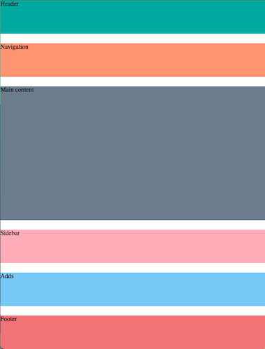

# GridAndMediaQueries
Activity to learn how to use grid and queries to create responsive website

Create responsive layouts for mobile, tablet, and desktop screens.

Mobile layout

 
Tablet layout

 
Desktop layout

